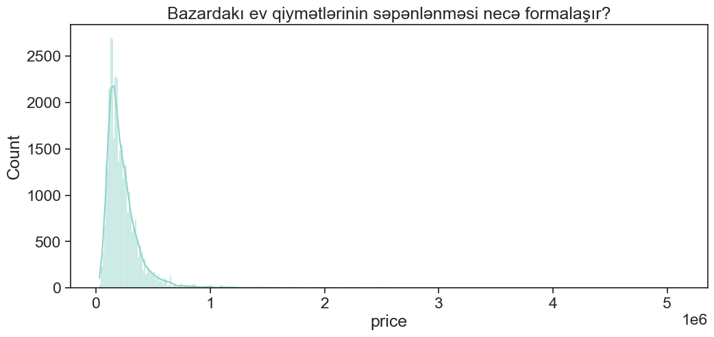
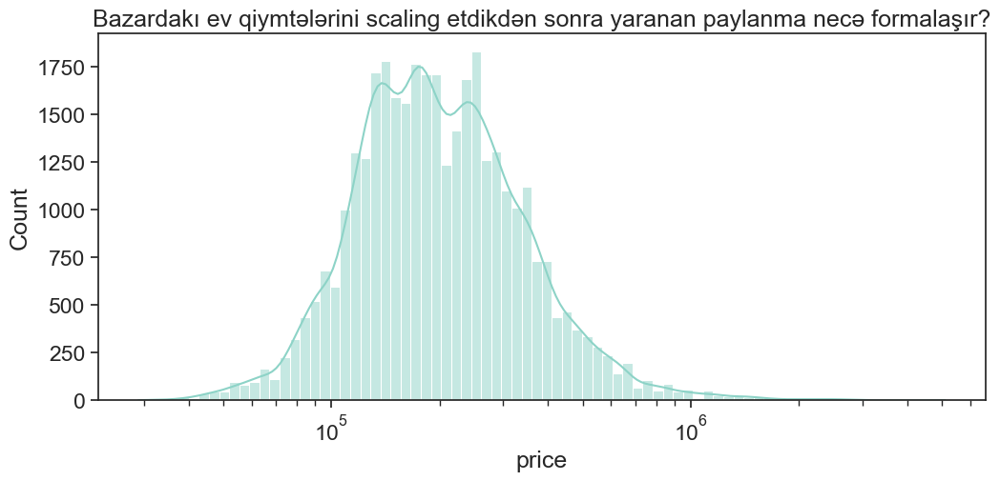
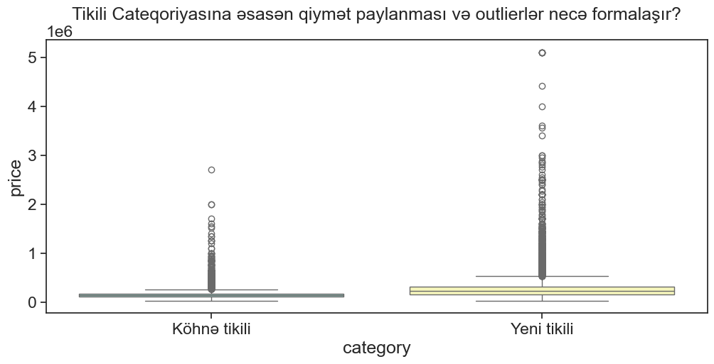
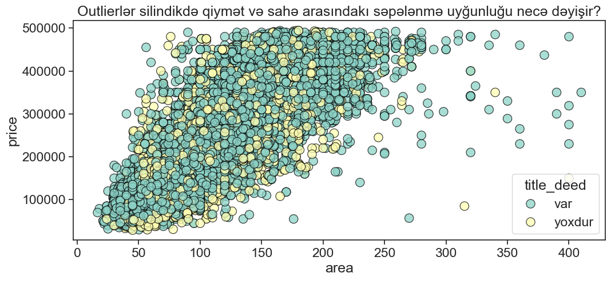
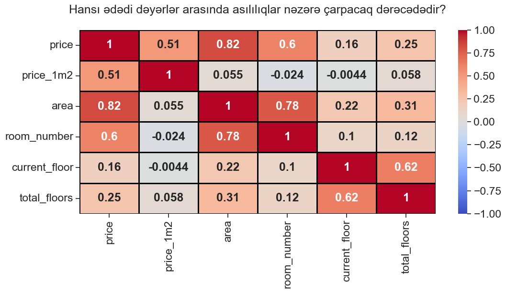
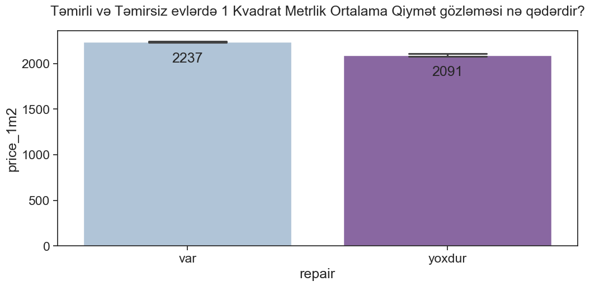
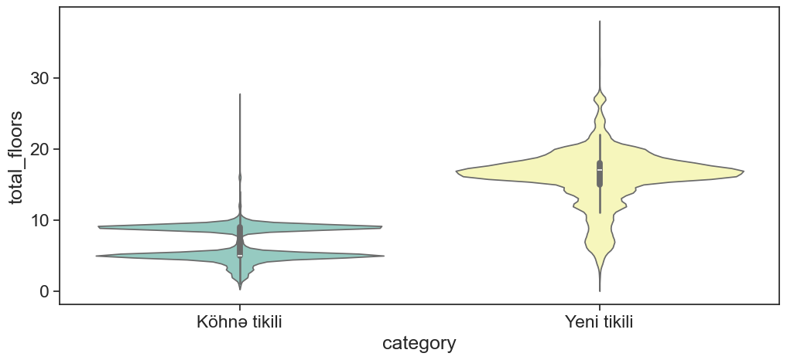
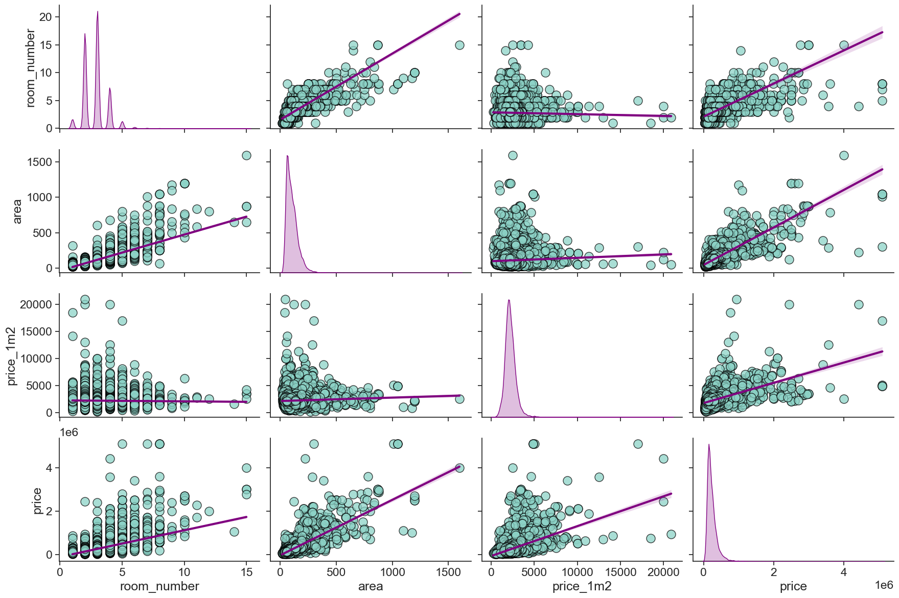

# **House Pricing EDA Project**
*Müəllif: Vüqar Nəsirli*

## **Layihə Haqqında İcmal**
Bu proyekt, daşınmaz əmlak bazarındakı satış elanlarına data analitikası perspektivindən yanaşaraq, xam məlumatların **Data Engineering** üsulları ilə təmizlənməsi, **Statistik Analizi** və nəticələrin **Storytelling** formatında vizuallaşdırılmasını əhatə edir. 

Əsas məqsəd mürəkkəb data mühəndisliyi və statistik yanaşmaları tətbiq etməklə bazarda qərar vermə prosesinə ciddi təsir göstərəcək dərin nəticələr çıxarmaqdır.

### **Alətlər Çantası (Tech Stack)**
Proyektdə Python dilinin ən güclü kitabxanalarından istifadə olunub:
*   **NumPy & Pandas:** Data manipulyasiyası və preprocessing.
*   **Matplotlib & Seaborn:** Statistik vizuallaşdırma.

---

## **1. Data Cleaning və Preprocessing (Məlumatların Təmizlənməsi)**
Analitik prosesə başlamazdan əvvəl məlumatlar aşağıdakı mərhələlərdən keçmişdir:
*   **Tip Konvertasiyası:** `price`, `price_1m2` və `area` sütunlarındakı simvollar ('AZN', 'm²') təmizlənərək ədədi formata (float/int) gətirilib .
*   **Mətnin Parçalanması:** `floor` sütunu parçalanaraq `current_floor` və `total_floors` adlı yeni sütunlar yaradılıb.
*   **Missing Values (Çatışmayan Dəyərlər):** Bütün sütunları NULL olan 37 sətir silinib. `repair` (təmir) və `mortgage` (ipoteka) sütunlarındakı boşluqlar istifadəçi davranışına uyğun olaraq "yoxdur" dəyəri ilə əvəzlənib.

---

## **2. Deskriptiv Statistika (Təsviri Statistika)**

### **Mərkəzi Tendensiya Göstəriciləri**
*   **Mode (135,000):** Bazarda qiymətlər daha çox bu rəqəm ətrafında qərarlaşıb.
*   **Median (192,000):** Bazarın 50%-i bu qiymətdən aşağı, digər 50%-i isə yuxarıdır.
*   **Mean (237,000):** Bazardakı ortalama qiymət gözləntisi.
*   **Skewness (7.26):** Məlumat kəskin müsbət (sağa) meyllidir. Bu, bazarda normadan çox bahalı evlərin (outlier) statistikanı süni şəkildə yüksəltdiyini göstərir.

### **Variasiya Göstəriciləri**
*   **IQR (700):** Məlumatın ortada yerləşən yarısında qiymət fərqi cəmi 700 manatdır.
*   **Standart Kənarlaşma (691):** Məlumatın böyük hissəsinin yaxın aralıqda dəyişdiyini göstərir.
*   Lakin maksimum qiymətin 21,000 (kv/m üçün) olması ciddi kənarlaşmaların (outliers) mövcudluğunu sübut edir.

---

## **3. Anomaliyaların (Outliers) Təsbiti: Z-Score vs IQR**
Kənar dəyərləri müəyyən etmək üçün iki fərqli metod müqayisə edilib:
1.  **Z-Score Metodu:** 472 outlier (1.33%). Bu metod skewness-dən təsirləndiyi üçün "outlier friendly" hesab olunur.
2.  **IQR Metodu:** 1,930 outlier (5.44%). Skewness-ə baxmayaraq daha düzgün analiz aparır və "outlier resistant" metod kimi seçilib.

---

## **4. Data Visualizations & Storytelling**

### **Qiymət Paylanması və Log Scaling**
İlkin qiymət paylanması kəskin sağa meyllidir. Log Scaling tətbiq edildikdə data normal paylanmaya daha çox yaxınlaşır.

*Şəkil: Bazar üzrə ilkin qiymət paylanması.*

*Şəkil: Log Scaling tətbiqindən sonrakı paylanma.*

**İnteraktiv Outlier Analizi:**
Aşağıdakı interaktiv vizualda outlier multiplier (band genişliyi) dəyişdikdə paylanmanın necə təmizləndiyini izləyə bilərsiniz.

*GIF: Outlier multiplier seçiminə görə formalaşan paylanma.*

### **Kateqoriyalara Görə Qiymət və Outlier Analizi**
Yeni tikililərdə həm sahə, həm də qiymət kənarlaşmaları köhnə tikililərə nisbətən daha kəskindir.

*Şəkil: Tikili kateqoriyasına görə qiymət paylanması və outlier-lər.*

### **Sahə və Qiymət Asılılığı**
Sahə və qiymət arasında güclü müsbət asılılıq (PCC = 0.82) var. Outlier-lər təmizləndikdə bu asılılıq daha stabil görünür.

*Şəkil: Outlier-lər silindikdən sonra sənədli və sənədsiz evlərin sahə/qiymət uyğunluğu.*

**İnteraktiv Slope (Meyllilik) Analizi:**
Sahə və qiymət arasındakı asılılıq kəskinliyini (slope) bu vizualda izləmək mümkündür.

*GIF: Sahə və qiymət asılılığındakı kəskinlik dərəcəsi.*

### **Korrelasiya Matrisi**
Əsas üç göstərici (qiymət, sahə, otaq sayı) arasında yüksək korrelasiya müşahidə olunur ki, bu da "Causation" (səbəb-nəticə) əlaqəsi ilə izah edilir.

*Şəkil: Ədədi dəyərlər arasındakı asılılıq matrisi.*

### **Təmirin Qiymətə Təsiri**
Təmirli evlərin 1 m²-lik ortalama qiyməti daha yüksəkdir və qiymət dəyişkənliyi (error bar) daha azdır.

*Şəkil: Təmirli və təmirsiz evlərdə ortalama kvadrat metr qiyməti.*

### **Mərtəbə Sayı və Tikili Növü**
Violin plot analizi göstərir ki, köhnə tikililər əsasən 5-10 mərtəbəli, yeni tikililər isə 20 mərtəbə civarında cəmləşib.

*Şəkil: Kateqoriyalar üzrə bina mərtəbə sayının paylanma sıxlığı.*

### **Çoxölçülü Müqayisə (Pairplot)**
Bütün əsas parametrlərin (otaq sayı, sahə, qiymət) bir-biri ilə qarşılıqlı əlaqəsi və fərdi paylanmaları.

*Şəkil: Proyektin ümumi asılılıq xəritəsi.*
